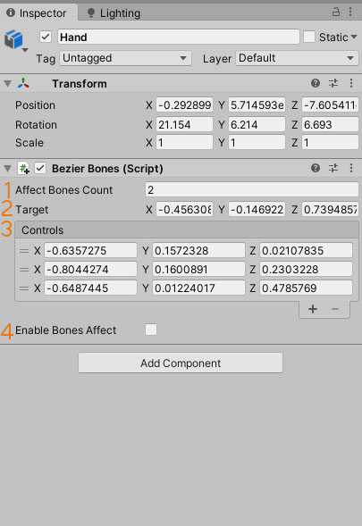

# Bezier bones
A tool for positioning bones along a bezier curve of any dimension.
In this case, only the rotation of the bone changes, its local position does not change.

## Setup

1. Add BezierBones component to the last affected bone
2. Specify count of affected bones (1)
3. Add the required number of control points (3)
4. Change the target position (2) and the position of the points (3) to get the desired curve
5. Enable affect to bones. The bones will try to follow the shape of the curve you specified. You can turn this on or off at any time if you only want to change the curve, without affecting the bones.

## Scene controls

You can also control the curve in the scene. To do this, select the desired point and change the position (3).

The points have two colors:
- Red - target point (1)
- Blue - control point (2)

The points are connected by a yellow line in the following order: root bone, control points, target point.

The bezier curve is displayed as a white line (4).
Affected bones are highlighted by green boxes (5).